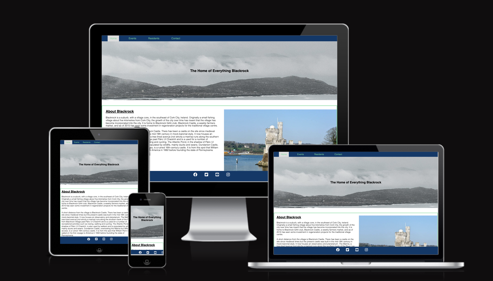
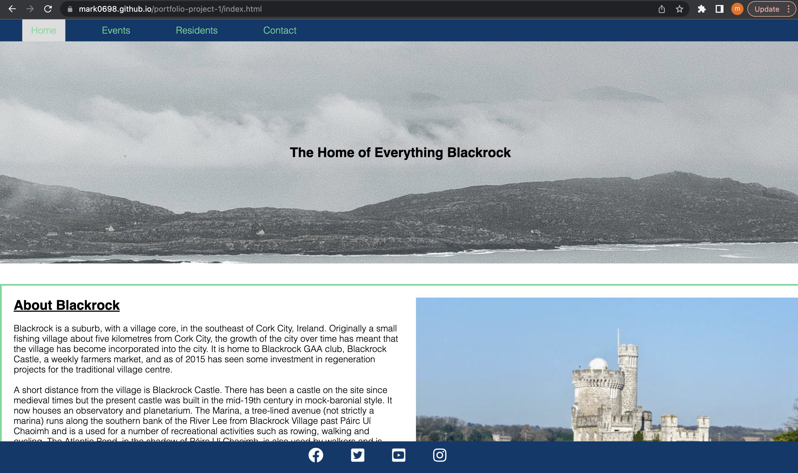
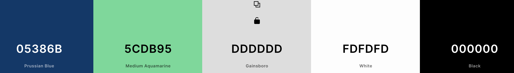
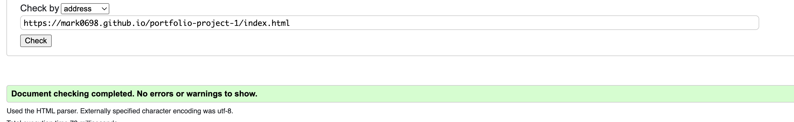
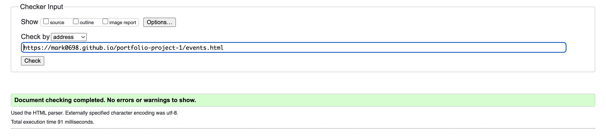

<h1> Read me File, Project 1<h1>
<h2> The History of Blackrock</h2>

 This is a website designed for all things Blackrock, Blackrock is a city on the southside of Cork City. This website provides insghts into the history of Blackrock, Noteable residents as well as upcoming and current events. 

 
<h4><u>Content</u></h4>
<li>Features</ul>
<li>Existing features
<li>Features left to implement
<li>Site structure
<li>Design Choices
<li>Typography</li>
<li>Color scheme</li>
<li>Technology used

<h3><u>Features</u></h3>
<h4><u>Existing feautures</u></h4>
<li>Navigation Bar</li>

Featured on all four pages, the full responsive navigation bar includes links to the About Home page, Events and Contact form and is identical in each page to allow for easy navigation as well as your location being highlighted on the navigation bar.
This section will allow the user to easily navigate from page to page across all devices without having to revert back to the previous page via the ‘back’ button.

<li>Landing page</li>

The index.html page is the about homepage, this page gives a brief overview of what the individual other pages provide.

On the landing page/homepage we have a brief divison which highlights briefly what is covered in more detail on the "Events Page"

We also briefly outline some of the notable people which are covered in more detail on the actual Residents page. These images also include links to the Residents page.

<li>The Footer </li>

The footer section includes links to the relevant social media sites for History of Blackrock. The links will open to a new tab to allow easy navigation for the user. While also keeping the user on our website and not diverting them away.
The footer is valuable to the user as it encourages them to keep connected via social media

<li>Contact form</li>

This page allows users to get in contact with the developers with detail to ask specific questions if there queries are not answered by the information on the webpage

<li>Contact Form landing page</li>

This page confirms for the user that their details have been sent to us. For this project it validates the form only.
It provides a direct link back to the home page as well as the normal navigation menu links in the header and footer.

<h3><u>Features left to implement </u></h3>
<li>Gallery</li>

A page to display photos and videos of recent events and historic events.

<li>Newsletter sign up</li>

A pop up that allows users to sign up to a newsletter.

<li>Shop</li>

A online store whihc allows users to easily purchase Blackrock merchandise with one button check and apple pay features.

<h3><u>Site Structure</u></h3>

History of Blackrock website has four pages. The home page is the default loading page, Events, Residents and Contact page are all accessible primarily from the navigation menu which is an ever present on all pages. The navigation bar allows for easy navigation without having to use the browsers arrows buttons. Headings allow you to see where you are at all times on the website as well as your location being highlighted in white on the navigation bar

<h3><u>Design Choices</u></h3>
<li>Typography</li>

The font used across the website was Sans Serif,Sans is a French word meaning "without". Thus, a sans serif is a typeface that has no traces or lines extending from the edges of letters and alphabets. This way, there are no curls, and the sans serif letters appear simple and rounded. The Sans font is clean and the best font for reading on screen.

<li>Color Scheme</li>

The colors I have selected are displayed in the pallette below, I chose these colours as I find the contrast pleasent to look at and also find the content easy to identify.

<h3><u>Technology Used</u></h3>
<li><a href="https://en.wikipedia.org/wiki/HTML">HTML</a>- provides the content and structure for the website</li>
<li><a href="https://en.wikipedia.org/wiki/CSS">CSS</a>- provides the styling.</li>
<li><a href="https://github.com/">Github</a>- used to host and edit the website.</li>
<li><a href="https://www.gitpod.io/">Gitpod</a>- used to deploy the website</li>

<h3><u>Testing</u></h3>
<h4>Code Validation</h4>

The History of Blackrock site has be throughly tested. All the code has been run through the W3C html Validator and the W3C CSS Validator. Minor errors were found on the home and inspiration pages. After a fix and retest, no errors were returned for both.

<li>Homepage</li>

<li>Events</li>
