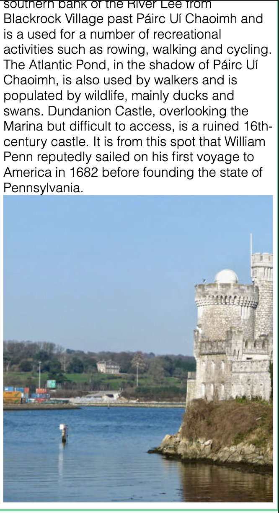

<h1> Read me File, Project 1<h1>
<h2> The History of Blackrock</h2>

 This is a  fictional website designed for all things Blackrock, Blackrock is a city on the southside of Cork City. This website provides insghts into the history of Blackrock, Noteable residents as well as upcoming and current events. 

 
<h4><u>Content</u></h4>
<li>Features</ul>
<li>Existing features
<li>Features left to implement
<li>Site structure
<li>Design Choices
<li>Typography</li>
<li>Color scheme</li>
<li>Technology used</li>
<li>Testing</li>
<li>Additional Testing</li>
<li>Known Bugs</li>
<li>Deployment</li>
<li>Credits</li>
<li>Acknowledgments</li>

<h3><u>Features</u></h3>
<h4><u>Existing feautures</u></h4>
<li>Navigation Bar</li>

Featured on all four pages, the full responsive navigation bar includes links to the About Home page, Events and Contact form and is identical in each page to allow for easy navigation as well as your location being highlighted on the navigation bar.
This section will allow the user to easily navigate from page to page across all devices without having to revert back to the previous page via the ‘back’ button.

<li>Landing page</li>

The index.html page is the "About" homepage, this page gives a brief overview of what the individual other pages provide.

On the landing page/homepage we have a brief divison which highlights briefly what is covered in more detail on the "Events Page"

We also briefly outline some of the notable people which are covered in more detail on the actual Residents page. These images also include links to the Residents page.

<li>The Footer </li>

The footer section includes links to the relevant social media sites for History of Blackrock. The links will open to a new tab to allow easy navigation for the user. While also keeping the user on our website and not diverting them away.
The footer is valuable to the user as it encourages them to keep connected via social media

<li>Contact form</li>

This page allows users to get in contact with the developers with detail to ask specific questions if there queries are not answered by the information on the webpage

<li>Contact Form landing page</li>

This page confirms for the user that their details have been sent to us. For this project it validates the form only.
It provides a direct link back to the home page as well as the normal navigation menu links in the header and footer.

<h3><u>Features left to implement </u></h3>
<li>Gallery</li>

A page to display photos and videos of recent events and historic events.

<li>Newsletter sign up</li>

A pop up that allows users to sign up to a newsletter.

<li>Shop</li>

A online store which allows users to easily purchase Blackrock merchandise with an easy checkout process.

<li>Improve loadspeed</li>

By compressing the images load speed and performance will be improved.

<h3><u>Site Structure</u></h3>

History of Blackrock website has five pages. The home page is the default loading page, Events, Residents and Contact page are all accessible primarily from the navigation menu which is an ever present on all pages. The navigation bar allows for easy navigation without having to use the browsers arrows buttons. Headings allow you to see where you are at all times on the website as well as your location being highlighted in white on the navigation bar. There is also a landing page for after you submit your contact form whihc has a link back to the index.html page.

<h3><u>Design Choices</u></h3>
<li>Typography</li>

The font used across the website was Sans Serif,Sans is a French word meaning "without". Thus, a sans serif is a typeface that has no traces or lines extending from the edges of letters and alphabets. This way, there are no curls, and the sans serif letters appear simple and rounded. The Sans font is clean and the best font for reading on screen.

<li>Color Scheme</li>

The colors I have selected are displayed in the pallette below, I chose these colours as I find the contrast pleasent to look at and also find the content easy to identify.

<h3><u>Technology Used</u></h3>
<li><a href="https://en.wikipedia.org/wiki/HTML">HTML</a>- provides the content and structure for the website</li>
<li><a href="https://en.wikipedia.org/wiki/CSS">CSS</a>- provides the styling.</li>
<li><a href="https://github.com/">Github</a>- used to host and edit the website.</li>
<li><a href="https://www.gitpod.io/">Gitpod</a>- used to deploy the website</li>

<h3><u>Testing</u></h3>
<h4>Code Validation</h4>

The History of Blackrock site has be throughly tested. All the code has been run through the W3C html Validator and the W3C CSS Validator. Minor errors were found on the home and inspiration pages. After a fix and retest, no errors were returned for both.

<li>Homepage</li>

<li>Events</li>

<li>Residents</li>

<li>Contact</li>

<h3><u>Additional Testing</u></h3>
<li>Google Lighthouse</li>

My site was also tested using Google Lighthouse in Chrome Developer Tools to test my webpage for:

<li>Performance - How the page performs whilst loading.</li>
<li>Accessibility - Is the site acccessible for all users and how can it be improved.</li>
<li>Best Practices - Site conforms to industry best practices.</li>
<li>SEO - Search engine optimisation. Is the site optimised for search engine result rankings.</li>

My perfomance suffered due to the large sized high quality images I have used, My next step would be to compress those images to improve performance.

<h4><u>Browser Compatibility</u></h4>

The site was tested on the following browsers with no visible issues for the user. Google Chrome, Microsoft Edge, Safari and Mozilla Firefox.

<h4><u>Known bugs</u></h4>
<li>Homepage castle picture responsiveness</li>

The image in the about section of the homepage is not perfect for mobile devices, I will utilise a media query to replace this image with a smaller more suited one on smaller devices.

<h3><u>Deployment</u></h3>
<h4>To deploy the project</h4>

The site was deployed to GitHub pages. The steps to deploy a site are as follows:
<ol>
<li>In the GitHub repository, navigate to the Settings tab.</li>
<li>Once in Settings, navigate to the Pages tab on the left hand side.</li>
<li>Under Source, select the branch to master, then click save.</li>
<li>Once the master branch has been selected, the page will be automatically refresh and the project will be available at the above link </li>
<li>The repository can be found at <a>https://github.com/mark0698/portfolio-project-1.git</a></li>
</ol>

<h4>To create a local clone of the project</h4>
<ol>
<li>Click on the tab titled "code".</li>
<li>In the Clone with HTTPS section, click on the copy and paste button next to the URL</li>
<li>In your IDE of choice, open Git Bash.</li>
<li>Change the directory to the location where you would like the repository</li>
<li>Type git clone, and then paste the URL copied from GitHub.</li>
<li>Press enter and a local copy of the repository will be created</li>
</ol>

<h3><u>Credits</u></h3>
<li>The color palette was created using <a href="https://coolors.co">Coolors</a></li>
<li>The Project was deployed using <a href="https://github.com/">Github</a></li>
<li>The project was written in <a href="https://www.gitpod.io/">Gitpod</a></li>
<li>The social media icons were from <a href="https://fontawesome.com/">Font Awesome</a></li>
<li>The content and photos on notable residents were from  their respective <a href="https://en.wikipedia.org/wiki/Wiki">Wiki's</a></li>
<li>The images were from <a href="https://www.pexels.com/">Pexels</a></li>
<li>Coding related queries were solved using <a href="https://codeinstitute.net/ie/">Code Institute</a>, <a href="https://www.w3schools.com/">W3schools</a>, <a href="https://www.w3.org/">W3</a> and <a href="https://stackoverflow.com/">Stack overflow</a></li>

<h3><u>Acknowledgements</u></h3>

I would like to thank Precious Ljege, my mentor for his help throughout this project as well as all at The Code Institue for help on my studies thus far.
